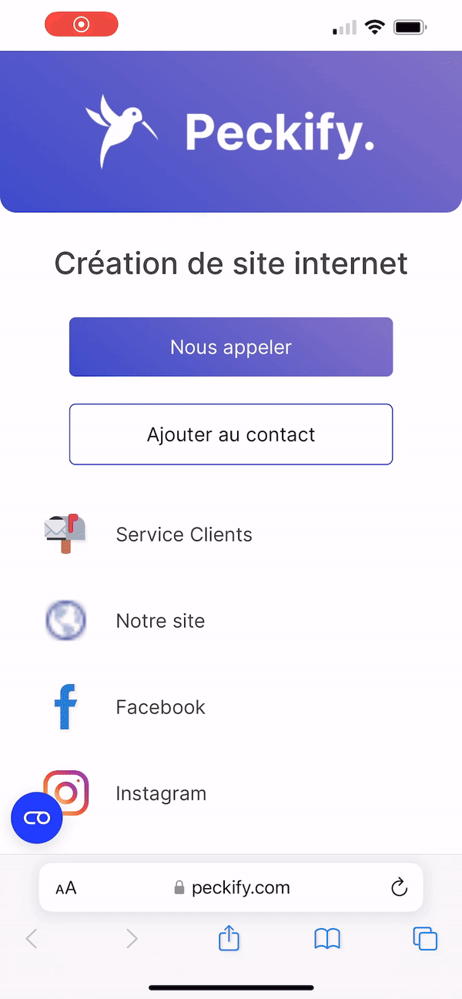
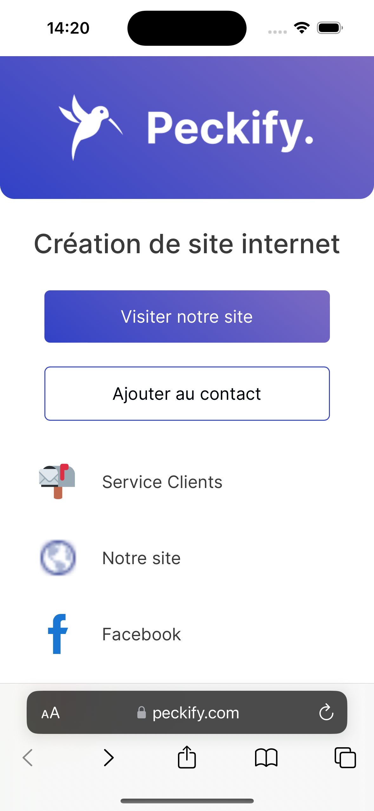

# Bouton & Titre

Pour configurer le bouton et le titre, rendez-vous dans la partie [QR Code de votre espace client](https://peckify.com/clients/dashboard/qr-code).

### Titre

Vous pouvez modifier le titre via le champ prévu à cet effet.

<figure><figcaption></figcaption></figure>

Nous conseillons de mettre le slogan de votre entreprise. Vous pouvez mettre votre nom s'il n'est pas écrit sur votre logo.

### Bouton CTA

Vous pouvez modifier le bouton CTA juste en bas du champ pour le titre.

<figure><figcaption></figcaption></figure>

Il existe 3 type de bouton `Mail`, `Téléphone` et `Lien`

#### Mail

Quand vous sélectionnez mail, l'utilisateur qui scannera votre QR Code et qui clique sur le bouton CTA ouvra directement un page pour envoyer un mail.

<figure><figcaption></figcaption></figure>

#### Téléphone

Quand vous sélectionnez "téléphone", l'utilisateur qui scannera votre QR Code et qui cliquera sur le bouton CTA lancera un appel directement.

<figure><figcaption></figcaption></figure>

#### Lien

Le type de lien permet de mettre un lien en avant, comme votre site internet. Il est conseillé d'utiliser ce bouton si vous n'avez pas de numéro ou d'adresse mail de contact pour vos clients.

<figure><figcaption></figcaption></figure>
